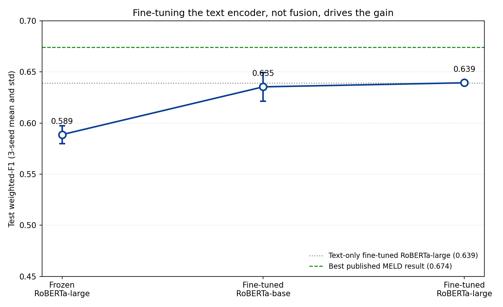
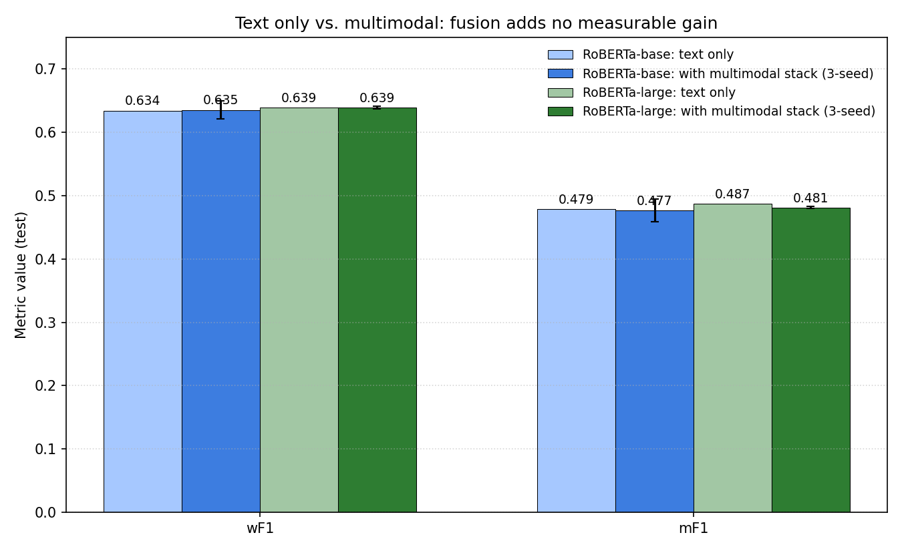
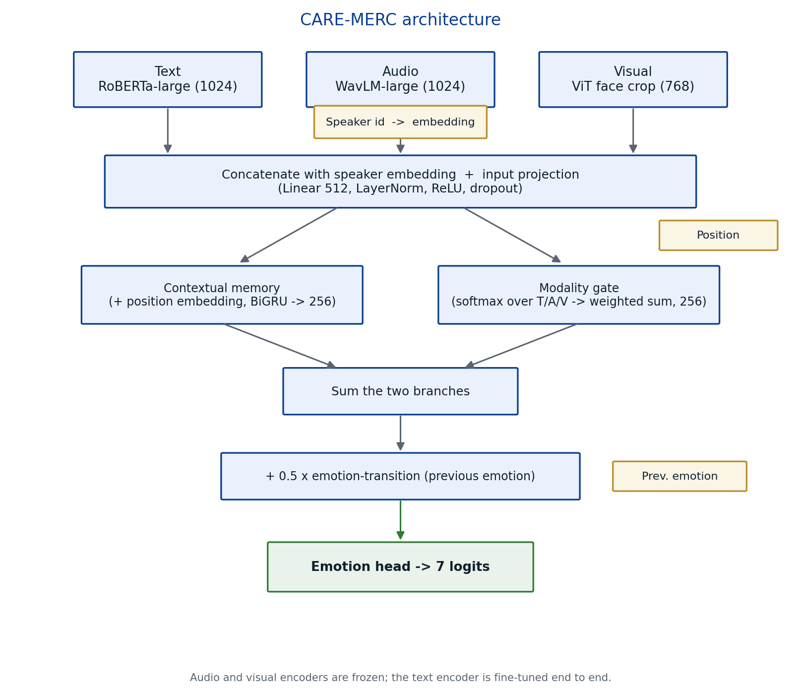
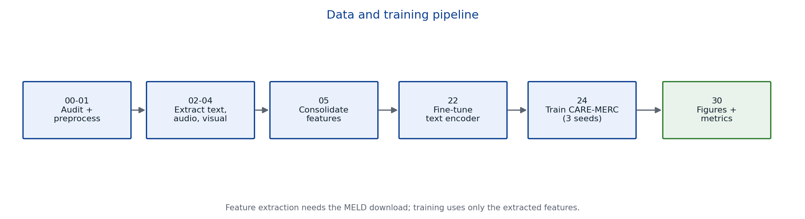

# CARE-MERC: Multimodal Emotion Recognition on MELD


**Stack:** PyTorch · RoBERTa-large / WavLM-large / ViT-base (Hugging Face) · MTCNN · a custom CARE-MERC fusion model · trained end to end on a single Apple M1 Pro laptop (16 GB, no GPU).

[Results](#results) · [Model](#model) · [Pipeline](#pipeline) · [Data](#data) · [Setup](#setup) · [Reproduce](#reproducing-the-pipeline) · [Full write-up](docs/results.md)

Utterance-level emotion recognition in conversation (ERC) on the 7-class
[MELD](https://affective-meld.github.io/) benchmark, combining text, audio, and
visual signals. CARE-MERC is a compact multimodal model, evaluated against a
fine-tuned text-only control:

> **Once the text encoder is fine-tuned, the frozen audio and visual features add
> nothing reliable.** Adding the full fusion stack to a fine-tuned RoBERTa-large
> text classifier changes weighted-F1 by about +0.0002 (well inside the
> across-seed std) and lowers macro-F1 by about 0.006. The headline 0.639
> weighted-F1 comes from the text encoder, not from multimodal fusion.

Multimodal ERC results on MELD are often reported without a fine-tuned text-only
baseline as a control. With that control, most of the apparent multimodal gain
disappears.

The audio and visual encoders are frozen, since the project ran on one Apple M1
Pro laptop (16 GB, no GPU). So the finding is about frozen, utterance-pooled
audio and visual features, not the modalities in general.

Author: Soumya Sephali Pradhan. Thesis project, 2026.

## Results

Final model: CARE-MERC with modality dropout and a fine-tuned RoBERTa-large text
encoder, plus frozen WavLM-large audio and ViT-base visual features. MELD test,
mean and std over 3 seeds (42, 43, 44):

| Metric        | Score               |
|---------------|---------------------|
| Accuracy      | **0.6485 ± 0.0061** |
| Weighted F1   | **0.6394 ± 0.0019** |
| Macro F1      | **0.4811 ± 0.0016** |

Against the literature:

| Method | Modalities | Encoders | wF1 | Acc |
|---|---|---|---|---|
| Multimodal DialogueRNN (2019, MELD paper) | T+A+V | GloVe + openSMILE + 3D-CNN | 0.603 | n/a |
| M2FNet (2022) | T+A+V | end-to-end fine-tuned | 0.665 | n/a |
| Sync-TVA (2025) | T+A+V | ResNet-50 + OpenSMILE + RoBERTa, graph attention | 0.674 | 0.683 |
| **This work** (3-seed mean) | T+A+V | fine-tuned RoBERTa-large + frozen WavLM + frozen ViT | **0.639** | **0.649** |
| This work, text only † | T | fine-tuned RoBERTa-large | 0.639 | 0.640 |

† Text-only baseline is a single seed (42); the multimodal row is a 3-seed mean. See [docs/results.md](docs/results.md) for the same-seed comparison.

This is about 3.5 points below the strongest published MELD result (Sync-TVA,
2025), which fine-tunes all three encoders end to end. Most of that gap comes
from the frozen audio and visual encoders, not the fusion design: frozen,
utterance-pooled features are weak for ERC.

<p align="center">
  
  
</p>

Full write-up (per-class scores, the text-only equivalence analysis, negative
results, reproducibility notes): [docs/results.md](docs/results.md).

## Model

CARE-MERC is an utterance-level classifier. Each utterance is represented by
three feature vectors plus speaker and conversational context, fused into a
single prediction. Code: [models/care_merc.py](models/care_merc.py).

<p align="center">
  
</p>

Components:

- **Speaker-aware embedding:** a learned embedding per speaker (304 + 1),
  concatenated with the modality features before projection.
- **Contextual memory:** an additive positional embedding followed by a
  single-layer BiGRU (a length-1 sequence with utterance-pooled features; see
  Limitations).
- **Adaptive modality gating:** a small network produces a softmax weight over
  the three modalities and takes a weighted sum, down-weighting an uninformative
  stream per example.
- **Emotion-transition term:** the previous utterance's emotion is embedded and
  added with a 0.5 weight, a cheap proxy for emotional inertia in dialogue.
- **Modality dropout:** during training, audio and visual are independently
  zeroed with p = 0.15 (text is never dropped); the single most useful
  architectural change on frozen features.

Training: 60 epochs, batch 32, AdamW (lr 1e-3, weight decay 1e-3), 5-epoch warmup
then cosine decay, early stopping (patience 5) on dev weighted-F1, label
smoothing 0.1, dropout 0.5, and normalized inverse-sqrt class weights for the
17:1 MELD imbalance. The model has 4.86M parameters and trains in about a minute
per seed on an M1 Pro once features are cached.

## Pipeline

Raw MELD video goes through per-modality feature extraction (RoBERTa, WavLM, ViT),
consolidation into one array per split, end-to-end fine-tuning of the text
encoder, training of CARE-MERC over 3 seeds, and evaluation.

<p align="center">
  
</p>

## Data

[MELD](https://affective-meld.github.io/) is about 13.7K utterances from
*Friends*, labelled with 7 emotions (anger, disgust, fear, joy, neutral, sadness,
surprise). The processed splits used here are 9,989 / 1,108 / 2,610
(train / dev / test) usable utterances after feature extraction.

The raw videos and CSVs (about 10 GB) are not in this repo. Download `MELD.Raw`
from the [official release](https://affective-meld.github.io/) and extract it
into `data/raw/` so the layout is:

```
data/raw/train/train_sent_emo.csv
data/raw/train/train_splits/*.mp4
data/raw/dev/...   data/raw/test/...
```

The label-encoded CSVs and dataset metadata produced by the pipeline are
committed under `data/processed/`, so the project is inspectable without the raw
download. The `video_path` column is repo-relative for portability.

## Setup

Python 3.10+ recommended.

```bash
python -m venv venv && source venv/bin/activate
pip install -r requirements.txt
python verify_setup.py            # checks Torch / MPS / transformers / OpenCV
```

`ffmpeg` is required for audio decoding (`brew install ffmpeg` on macOS). The
code selects MPS on Apple Silicon, CUDA if present, otherwise CPU. The first
feature-extraction run downloads RoBERTa-large, WavLM-large, and ViT-base from
Hugging Face (a few GB).

## Reproducing the pipeline

Scripts are numbered in execution order. Feature extraction needs the raw MELD
download; training needs only the extracted features.

```bash
# 1. Inventory the raw dataset and preprocess labels
python scripts/00_audit_dataset.py
python scripts/01_preprocess.py

# 2. Extract per-modality features
python scripts/02_extract_text.py        # RoBERTa-large [CLS]      -> (N, 1024)
python scripts/03_extract_audio.py       # WavLM-large, 16 kHz mono -> (N, 1024)
python scripts/04_extract_visual.py      # MTCNN face crop + ViT     -> (N, 768)
python scripts/05_consolidate.py         # merge to consolidated.npz per split

# 3. Frozen-feature baseline (3 seeds)
for s in 42 43 44; do python scripts/13_train_frozen.py --seed $s; done

# 4. Fine-tune the text encoder and re-extract features
python scripts/22_finetune_roberta_large.py

# 5. Train the final model (3 seeds)
for s in 42 43 44; do python scripts/24_train_ftlarge.py --seed $s; done

# 6. Regenerate figures and diagrams
python scripts/30_make_plots.py
python scripts/31_make_diagrams.py
```

Step 6 reads the committed per-seed results in `results/`. Regenerating those
from scratch also requires the frozen-feature track (`scripts/13_train_frozen.py`,
3 seeds), the RoBERTa-base track (`scripts/20_finetune_roberta.py` then
`scripts/23_train_ftbase.py`, 3 seeds), and the linear-probe check
(`scripts/11_text_lr_probe.py`), which produce the other comparison points in the
figures.

## Repository layout

```
models/care_merc.py    CARE-MERC model
utils/dataset.py       dataset / dataloader
scripts/               numbered pipeline (audit -> extract -> fine-tune -> train -> plot)
data/processed/        label-encoded CSVs + metadata (committed)
results/               per-seed JSON metrics
docs/figures/          figures and diagrams
docs/                  results report, references, model card
verify_setup.py        environment check
```

Large artifacts (`features/`, `checkpoints/`, raw videos) are gitignored and
regenerate from the pipeline above.

## What did and didn't work

Selected findings; full account in [docs/results.md](docs/results.md). MELD here
is 7 classes, a 17:1 imbalance, and about 10K utterances.

- **Helped:** fine-tuning the text encoder (+0.046 wF1, by far the largest gain),
  modality dropout, normalized inverse-sqrt class weights, label smoothing.
- **Did not help:** LDAM-DRW and focal loss (both collapsed to near-degenerate
  predictions at this class count), supervised contrastive loss (too few minority
  positives per batch at batch size 32), a gradient-reversal speaker adversary
  (304 speakers is too sparse), and cross-modal attention over length-1 pooled
  features (mathematically a linear projection).

Reproducibility caveat: PyTorch's MPS backend gave about 0.012 wF1 spread on
same-seed reruns, wider than the across-seed std. All final numbers are reported
as 3-seed mean and std for that reason.

## Limitations

- Audio and visual encoders are **frozen**; the text-only equivalence finding is
  partly conditioned on that. A fine-tuned audio encoder might recover prosodic
  signal the frozen one discards.
- **MELD only.** No cross-dataset (IEMOCAP, EmoryNLP) generalization study.
- **Utterance-level** fusion only; no token- or frame-level modeling, which is
  likely where finer-grained methods earn their margin.

## How to cite

```bibtex
@misc{pradhan2026caremerc,
  author       = {Soumya Sephali Pradhan},
  title        = {CARE-MERC: Multimodal Emotion Recognition on MELD},
  year         = {2026},
  howpublished = {\url{https://github.com/psoumyasephali/multimodal-emotion-recognition-meld}}
}
```

Key references (RoBERTa, WavLM, ViT, MELD, and the comparison baselines) are in
[docs/references.md](docs/references.md).

## Acknowledgments

Thanks to the MELD authors (Poria et al., 2019) for the dataset, and to the
RoBERTa, WavLM, and ViT teams for the open pretrained weights. Hugging Face
Transformers provided the feature-extraction and fine-tuning tooling.

## License

Code is released under the [MIT License](LICENSE). The MELD dataset is governed
by its own license and terms from the original authors.
