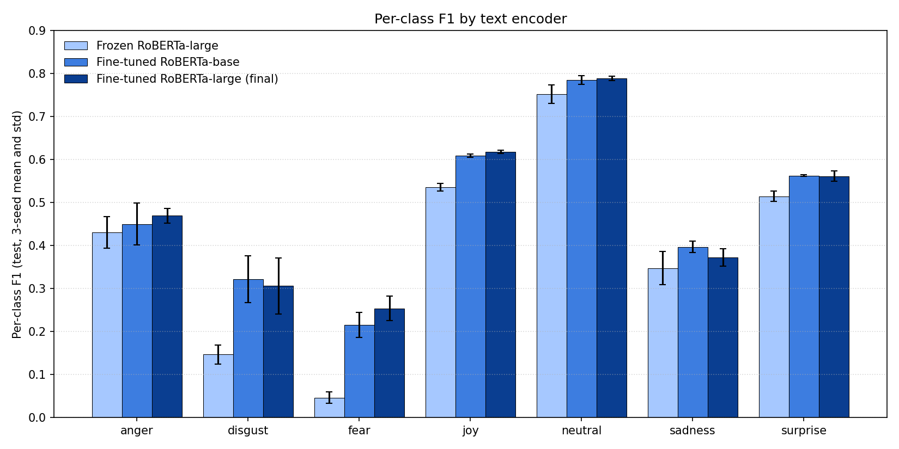
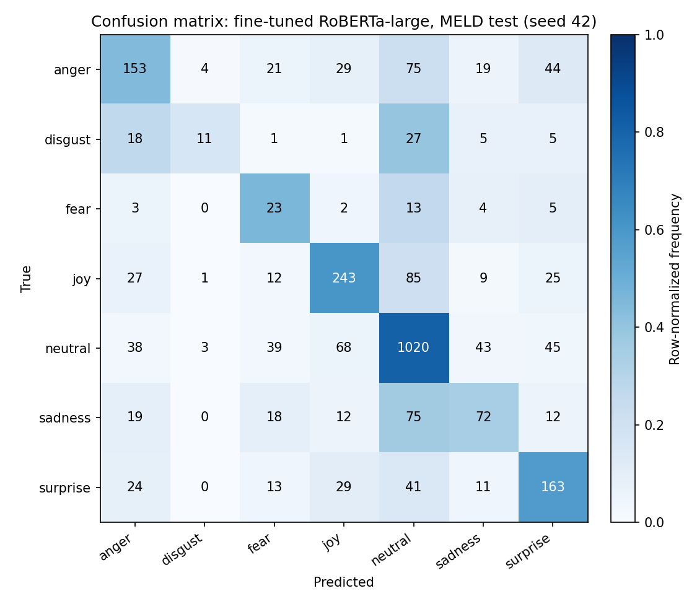

# Results and Analysis

An empirical study of multimodal emotion recognition on MELD, built around one
question: how much do audio and visual modalities contribute once the text
encoder is fine-tuned end to end?

Final model (CARE-MERC with modality dropout, fine-tuned RoBERTa-large text,
frozen WavLM-large audio, frozen ViT-base visual), MELD test, 3-seed mean and std:

- Accuracy: 0.6485 ± 0.0061
- Weighted F1: 0.6394 ± 0.0019
- Macro F1: 0.4811 ± 0.0016

The fusion stack adds +0.0002 weighted-F1 over a fine-tuned text-only classifier
(inside the across-seed std) and lowers macro-F1 by about 0.006. The headline
number is a text result with a multimodal wrapper around it.

## 1. How the project evolved

Each step was driven by a diagnostic from the previous one, not by a
hyperparameter sweep.

| Stage | Text encoder | Test wF1 | Test mF1 | Test acc |
|---|---|---|---|---|
| Cross-modal attention baseline † | frozen RoBERTa-large | 0.518 | 0.273 | 0.563 |
| + class-imbalance fixes † | frozen RoBERTa-large | 0.520 | 0.313 | 0.537 |
| CARE-MERC + modality dropout (3 seeds) | frozen RoBERTa-large | 0.589 ± 0.009 | 0.396 ± 0.013 | 0.603 ± 0.014 |
| CARE-MERC + modality dropout (3 seeds) | fine-tuned RoBERTa-base | 0.635 ± 0.014 | 0.477 ± 0.018 | 0.637 ± 0.013 |
| **CARE-MERC + modality dropout (3 seeds)** | **fine-tuned RoBERTa-large (final)** | **0.639 ± 0.002** | **0.481 ± 0.002** | **0.649 ± 0.006** |

† Early-development runs. Metrics come from training logs and are not retained as
JSON artifacts in `results/`; the three 3-seed rows below are fully reproducible
from the committed per-seed files.

The first two steps came from logged minority-class collapse and a finding that
the early cross-modal attention was degenerate on length-1 pooled features. Then
the frozen multimodal stack (0.589 wF1) barely edged a plain linear probe on text
alone (0.584 wF1). That was the turning point: the modality machinery was buying
almost nothing over a linear classifier on frozen text, so the next step was to
fine-tune the text encoder rather than add to the fusion. Moving from the base to
the large encoder narrowed the gap to published baselines and tightened the
across-seed variance.

## 2. Text-only equivalence (the main finding)

This is the central result; it undercuts the premise of the model:

| Configuration | Text-only fine-tuned † | With full CARE-MERC stack | Δ wF1 | Δ mF1 |
|---|---|---|---|---|
| RoBERTa-base | wF1 0.6344 / mF1 0.4787 | wF1 0.6354 / mF1 0.4769 | +0.0010 | -0.0018 |
| RoBERTa-large | wF1 0.6392 / mF1 0.4875 | wF1 0.6394 / mF1 0.4811 | +0.0002 | -0.0064 |

† The text-only baselines are single-seed (seed 42); the multimodal columns are
3-seed means, so these deltas compare a mean against one run. The fairer same-seed
comparison (seed 42 only) for RoBERTa-large is multimodal 0.6415 vs. text-only
0.6392, a +0.0023 wF1 gain and a -0.0080 macro-F1 loss. That +0.0023 is well
inside the ~0.012 same-seed run-to-run spread on the MPS backend (section 6), so
it is not distinguishable from noise, and macro-F1 still goes down.

Either way the fusion components (speaker-aware embedding, contextual memory,
adaptive modality gating, emotion-transition term, modality dropout) add no
reliable weighted-F1 over the fine-tuned text classifier, in both encoder sizes,
and they lower macro-F1.

This lines up with the variance-ratio measurements. The ratio of between-class to
within-class variance of the pooled features (higher means more
class-discriminative signal) is 6e-4 for frozen WavLM-large audio
(attention-pooled) and 2.2e-3 for frozen ViT-base visual (on MTCNN face crops),
both within an order of magnitude of noise. A linear probe on
`concat(text + audio + visual)` does worse than text alone (0.538 vs. 0.584 wF1):
adding audio and visual is a net loss when the text is well encoded.

At utterance-level granularity with frozen audio and visual encoders, the two
non-text modalities are not load-bearing for MELD emotion classification. The
practical takeaway: when comparing multimodal ERC numbers on MELD, check whether
there is a fine-tuned text-only baseline. Without one, some of the reported
fusion gain may just be the text encoder.

## 3. Per-class F1

| Class | Test support | Frozen RoBERTa-large | Fine-tuned RoBERTa-base | Fine-tuned RoBERTa-large |
|---|---|---|---|---|
| anger | 345 | 0.430 ± 0.037 | 0.450 ± 0.049 | 0.469 ± 0.017 |
| disgust | 68 | 0.146 ± 0.023 | 0.321 ± 0.054 | 0.306 ± 0.065 |
| fear | 50 | 0.046 ± 0.013 | 0.215 ± 0.029 | 0.254 ± 0.029 |
| joy | 402 | 0.535 ± 0.009 | 0.609 ± 0.004 | 0.617 ± 0.004 |
| neutral | 1256 | 0.752 ± 0.022 | 0.785 ± 0.010 | 0.788 ± 0.005 |
| sadness | 208 | 0.347 ± 0.038 | 0.396 ± 0.013 | 0.372 ± 0.020 |
| surprise | 281 | 0.514 ± 0.012 | 0.562 ± 0.002 | 0.561 ± 0.012 |

The minority classes saw the largest absolute gains from fine-tuning (fear F1 went
0.046 to 0.215 to 0.254, roughly 5x relative). That gain came entirely from
fine-tuning the text encoder. The frozen RoBERTa-large representations lacked the
signal for the rare classes; fine-tuning on MELD aligned the representation to the
task. Remaining errors concentrate around neutral (48% of the test set): joy,
sadness, and anger are each most often confused with neutral, the largest
off-diagonal cells in the confusion matrix.

## 4. What worked

In the order applied:

- **Normalized inverse-sqrt class weighting**: `w_i = K * (1/sqrt(n_i)) / sum_j(1/sqrt(n_j))`,
  giving `[0.82, 1.65, 1.66, 0.65, 0.40, 1.04, 0.78]`. Distinct from the
  unnormalized `(N/(K*n_i))^0.5`, which has the same shape but about 1.4x the
  magnitude and over-pushes toward minority classes. The normalized form gave
  +0.010 wF1 in a controlled comparison.
- **Label smoothing 0.1**, held constant across every run.
- **Dropout 0.5, weight decay 1e-3, early stopping (patience 5)** together kept
  the model from overfitting inside the 60-epoch budget.
- **Modality dropout p = 0.15** on audio and visual independently, text never
  dropped. The largest architectural gain before re-extracting text features:
  +0.008 wF1 / +0.022 macro-F1 on frozen features.
- **Fine-tuning the text encoder end to end**: the single largest gain in the
  project, +0.046 wF1 from the frozen-feature run to the fine-tuned-base run, and
  a further +0.004 wF1 with the large encoder.

An auxiliary sentiment head gave a small macro-F1 lift (about +0.009) with flat
wF1; under a `dev_wF1 + 0.5*dev_mF1` selection rule it ranked behind modality
dropout and was dropped, since combining the two did not beat modality dropout
alone.

## 5. What didn't work

Documented because these are commonly assumed to help and did not, at this scale:

- **LDAM-DRW (s=30)** was designed for long-tail ImageNet (hundreds of classes,
  ratios up to 200:1). At 7 classes and 17:1, the logit scaling pushed early
  losses to about 58 and produced an unlearnable landscape; runs collapsed to
  neutral-only.
- **Focal loss (gamma=2)** collapsed to minority-only predictions (16% accuracy in
  one run). It amplified label noise on the rare classes here.
- **Supervised contrastive (weight 0.3, batch 32)**: disgust and fear are about
  2.7% support each, so there is well under one expected positive per batch for
  the classes that need help. Batch 256 was not feasible in 16 GB.
- **Gradient-reversal speaker adversary**: 304 speakers at about 33 utterances
  each is too sparse to produce useful invariance gradients; it added variance
  without signal.
- **Cross-modal Transformer attention on length-1 pooled features**: with sequence
  length 1, `softmax(QK^T)` is identically 1, so the attention reduces to a linear
  projection. The original formulation was degenerate by construction.
- **Mixup with batch-mean lambda** was not equivalent to per-sample mixup when CE
  reduces by mean; the formulation quietly biased gradients.
- **Scheduled sampling on the previous-emotion input** raised test wF1 by +0.006
  but dropped dev wF1 by 0.0054, so dev-based early stopping selected a worse
  model. Dropped under the dev-selection rule.

## 6. Reproducibility note (MPS)

The same script and seed (42) produced test wF1 = 0.5966 at one stage and 0.5843
at another, a 0.012 spread on supposedly identical runs. PyTorch's MPS backend
does not guarantee bit-for-bit reproducibility even with Python, NumPy, and Torch
RNGs seeded. That spread is about 1.4x the across-seed std observed in the
frozen-feature run (0.0088).

The practical implication: single-seed numbers from Apple-Silicon PyTorch ports
should not be trusted on their own. All final results here are 3-seed mean and
std. The final-model std of 0.0019 wF1 is narrower than the same-seed MPS spread:
the configuration sits close enough to the optimum that backend noise outweighs
seed variation.

## 7. Limitations

- Frozen audio (WavLM-large) and visual (ViT-base on face crops) features. The
  text-only equivalence finding is partly an artifact of this; a fine-tuned audio
  encoder might capture prosody the frozen one cannot.
- MELD only. No cross-dataset generalization study (IEMOCAP, EmoryNLP, DailyDialog).
- Utterance-level granularity only; no token- or frame-level fusion.
- No leave-one-speaker-out evaluation.
- About 3.5 points below the strongest published result (Sync-TVA, 2025). The
  contribution is the analysis, not a benchmark win.

## 8. Per-seed detail (final model)

| Seed | Best epoch | Test wF1 | Test mF1 | Test acc |
|---|---|---|---|---|
| 42 | 2 | 0.6415 | 0.4795 | 0.6456 |
| 43 | 0 | 0.6380 | 0.4826 | 0.6444 |
| 44 | 2 | 0.6387 | 0.4811 | 0.6556 |
| **Mean ± std** | | **0.6394 ± 0.0019** | **0.4811 ± 0.0016** | **0.6485 ± 0.0061** |

Raw per-seed metrics are in `results/caremerc_ftlarge_s*.json`; the text-only
fine-tuned baselines in `results/roberta_finetune.json` and
`results/roberta_large_finetune.json`; the linear-probe check in
`results/text_lr_probe.json`.

## Note on split sizes

MELD ships 1,109 labelled dev utterances; one drops out at feature consolidation
(a missing/unreadable clip), leaving 1,108 used here. `data/processed/metadata.json`
records the labelled counts (9,989 / 1,109 / 2,610); training uses 9,989 / 1,108 / 2,610.
